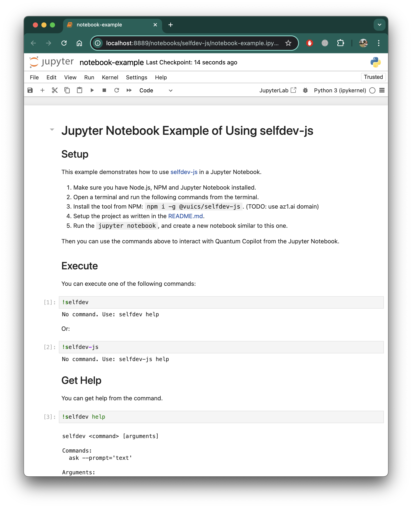

# selfdev-js

The selfdev-js is a command line tool for interacting with the [Self-developing](https://h9y.ai) API.

You can read the [API.md](./API.md) document to learn more about the Self-developing API.

## Install

You can install the package from NPM globally:
```bash
npm i -g @vuics/selfdev-js
```

Or install locally from the repo:
```bash
npm i
```

## Setup

TODO: use h9y.ai domain
Create an API key on [Self-developing](https://h9y.ai/keys).
Create `.env` file with the following content:
```
SELFDEV_API_URL=https://api.h9y.ai/v1
SELFDEV_API_KEY=<GET_API_KEY_ON_SELFDEV>
```

## Run

To run:
```bash
selfdev
selfdev help
```

## Usage Examples

### Ask

Ask a question and get an answer.
```bash
selfdev ask --prompt='What is a self-developing AI?'
```
Example output:
```
Self-developing AI refers to artificial intelligence systems that have the capability to autonomously improve, adapt, or develop their own algorithms and functionalities based on their experiences, interactions, or the data they process. This concept typically encompasses several key features:

1. **Learning from Experience**: Self-developing AI can learn from its past actions and the outcomes of those actions, refining its models and strategies over time to enhance performance.

2. **Autonomous Improvement**: Such systems can modify their own architecture or algorithms without human intervention to better solve problems or adapt to new environments.

3. **Exploration and Exploitation**: They can balance exploring new strategies or approaches (exploration) with leveraging what they already know to maximize performance (exploitation).

4. **Continuous Learning**: Self-developing AI systems often employ reinforcement learning or other adaptive methods that allow them to continuously learn and evolve as they encounter new data or scenarios.

5. **Meta-Learning**: Sometimes referred to as "learning to learn," this involves creating models that can adapt their learning strategies based on the tasks they are faced with.

6. **Generative Models**: Some self-developing AI systems may utilize generative models to create new hypotheses or ideas, which can then be tested and refined.

It's important to note that while the idea of self-developing AI is a significant area of research and promises many benefits, it also raises ethical and safety concerns. For example, if AI systems operate without sufficient oversight, they could make decisions that are unintended or harmful. As such, the development and deployment of self-developing AI systems necessitate careful consideration of governance, accountability, and ethical implications.
```

### Mail

Send an email message.
```bash
selfdev mail --to='admin@vuics.com' --from='admin@vuics.com' --subject='Email Test' --text='Hello, World!'
```
Example output:
```bash
{ result: 'ok' }
```

### Publish a Landing Page

```bash
html="""
<h1>My First Heading</h1>
<p>My first paragraph.</p>
"""

selfdev land --title='My Landing Page' --favicon='http://oflisback.github.io/react-favicon/img/github.ico' --body='{html}' --interestForm='true'
```
Example output:
```bash
{ result: 'ok', landingId: '676c057b4a9c5414c3f07132' }
```
After you get the JSON response from the `selfdev` utility, you can open the web page using the `landingId` value substituting it to the url `http://localhost:3000/landing/{landingId}`.

Open [http://localhost:3000/landing/676c057b4a9c5414c3f07132](http://localhost:3000/landing/676c057b4a9c5414c3f07132).

### Get Interest

```bash
selfdev = interest --landingId="{landingId}"
```


## Use in Jupyter Notebook

It is possible to use the selfdev-js directly from your Jupyter Notebooks.
See the [notebook-example.ipynb](./notebook-example.ipynb) for more information.



